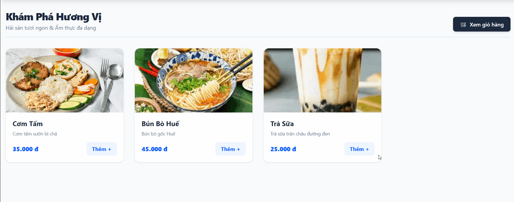

Rate limit: 2 request/s, wait 500ms before throw error

Circuit beaker:
- ngưỡng lỗi 25%
- số lần gọi tối thiêu: 4
- thử lại sau: 20s
- mô tả test: 2 lần đầu thành công, lần thứ 3,4 thất bại do tắt FoodService (đã đạt 4 lần gọi và ngưỡng lỗi 50%), từ lần thứ 5 không cho gọi nữa (trạng thái OPEN), sau 20s cho gọi lại

